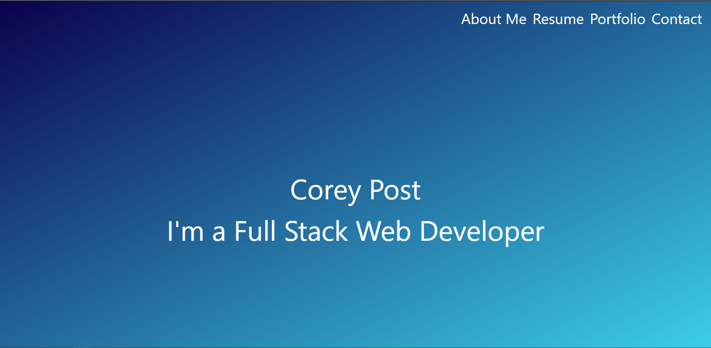

# Portfolio

This is my Portfolio.

## Link to the website

My live deployment of my Portfolio is located here: <https://eelektrick.github.io/Portfolio/>

Link to GitHub: <https://github.com/Eelektrick>

Link to LinkedIn: <https://www.linkedin.com/in/corey-post-2360731a6/>

## My Journey with Portfolio

Thought about keeping the same look and adding the differences required.

But I wanted to change some of the look up from the previous version. 

I believe this is a better looking outcome compared to the previous iteration.

Took longer than expected with the adjustments to work with the linear gradient background.

## How to use the Portfolio

Start by viewing my welcome page.

Next you will click on either option of About me, resume, portfolio, and contact in the top right to visit the other parts of my portfolio page.

Links are at the bottom of the contact page to speak to me in 4 different ways.